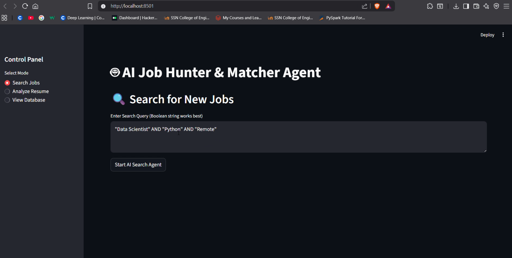
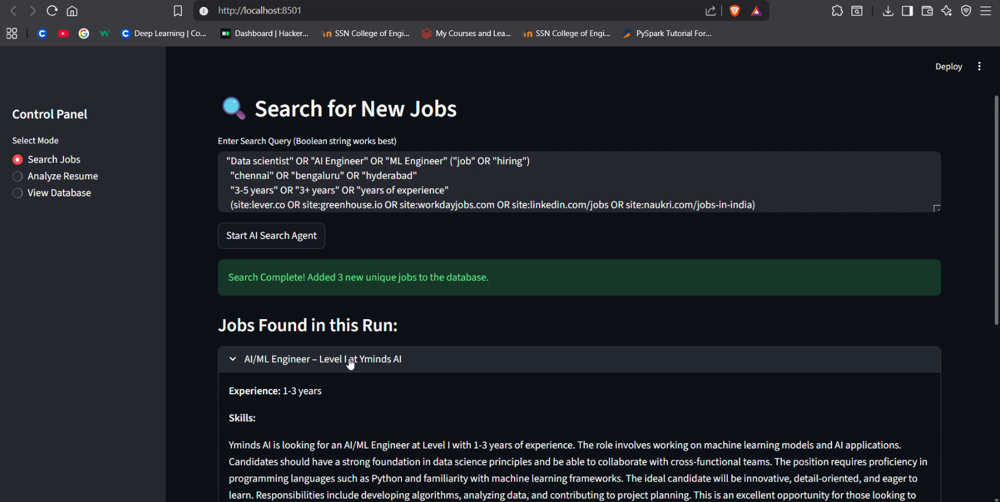
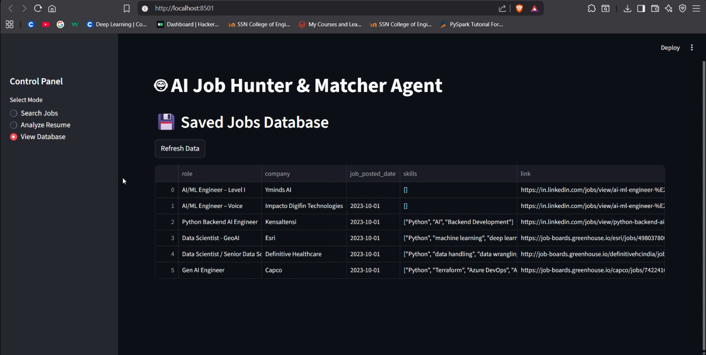
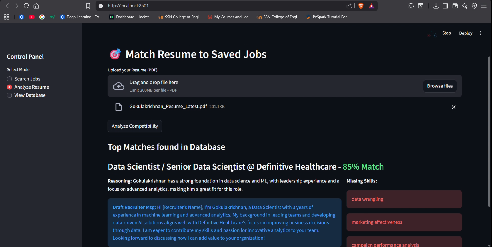

# 🤖 CareerSync AI: Autonomous Job Hunt Agent

**CareerSync AI** is an intelligent, full-stack agentic workflow designed to automate the modern job hunt. It doesn't just search for jobs; it scrapes them, builds a persistent knowledge base, and uses RAG (Retrieval-Augmented Generation) to semantically match your resume against the market.

---

## 🚀 Key Features

* **🕵️‍♂️ Autonomous Discovery:** Intelligent agent that queries Google Search, scrapes job boards, and filters duplicates automatically.
* **🧠 Cognitive Extraction:** Uses LLMs to parse unstructured HTML from career pages into structured JSON (Skills, Experience, Summary).
* **💾 Dual-Memory System:**
    * **Structured:** SQLite for metadata and historical tracking.
    * **Semantic:** ChromaDB (Vector Store) for understanding the *meaning* of job descriptions.
* **🎯 Smart Matching:** Embeds your PDF resume and uses cosine similarity to find the best-fit roles in your database.
* **📊 Compatibility Reports:** Generates detailed analysis for every match, including:
    * Match Score (0-100%)
    * Gap Analysis (Missing Skills)
    * Drafted Recruiter Outreach Messages

---

## 🏗️ Architecture

The system is built on **LangGraph**, treating the job hunt as a state machine.

---

## 🛠️ Tech Stack
**Orchestration**: LangChain, LangGraph

**Frontend**: Streamlit

**LLMs**: OpenAI GPT-4o / Groq (Llama 3)

**Vector Database**: ChromaDB

**Embeddings**: SentenceTransformers (all-MiniLM-L6-v2)

**Tools**: Google Search API, WebBaseLoader, Docling (PDF Parsing)

---

## ⚡ Quick Start
*1. Clone the Repository*

    git clone [https://github.com/Gokul-A/CareerSync-AI.git](https://github.com/Gokul-A/CareerSync-AI.git)
    cd CareerSync-AI

*2. Install Dependencies*

    pip install -r requirements.txt

*3. Configure Secrets in sys_env.py*

    CSI_ID = "your_google_cse_id"
    google_search_key = "your_google_api_key"
    groq_key = "your_groq_api_key"
    open_ai_key = "your_openai_api_key"

*4. Run the Agent*

    streamlit run Job_Agent_App.py

---

## 🖥️ Usage Guide
**Search Mode:** Enter a boolean search string (e.g., "Data Scientist" AND "Remote"). The agent will browse the web and populate your local database.

**Analyze Mode:** Upload your resume (PDF). The agent will retrieve the most relevant jobs you've found and score them based on your actual experience.

**View Mode:** Browse your saved job history and track your application pipeline.

## App Preview

